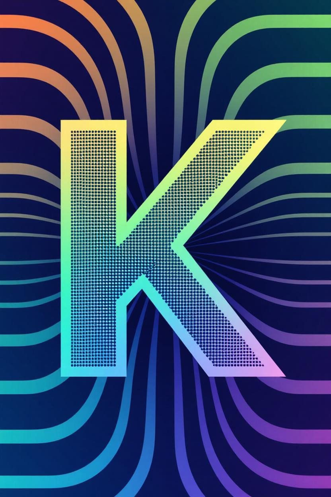
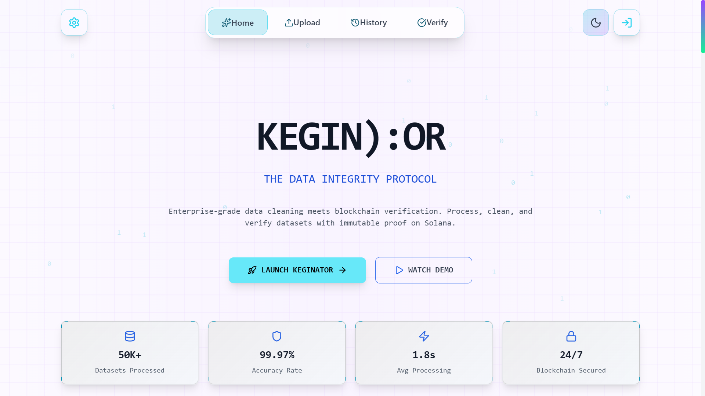
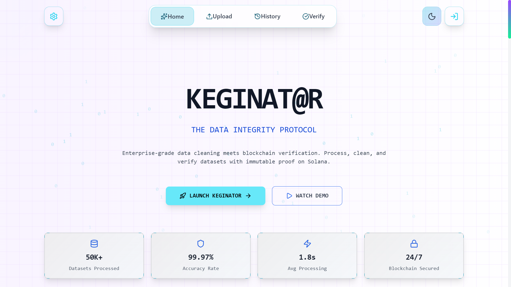
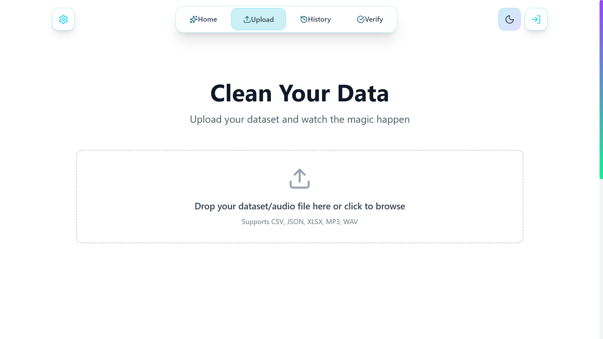
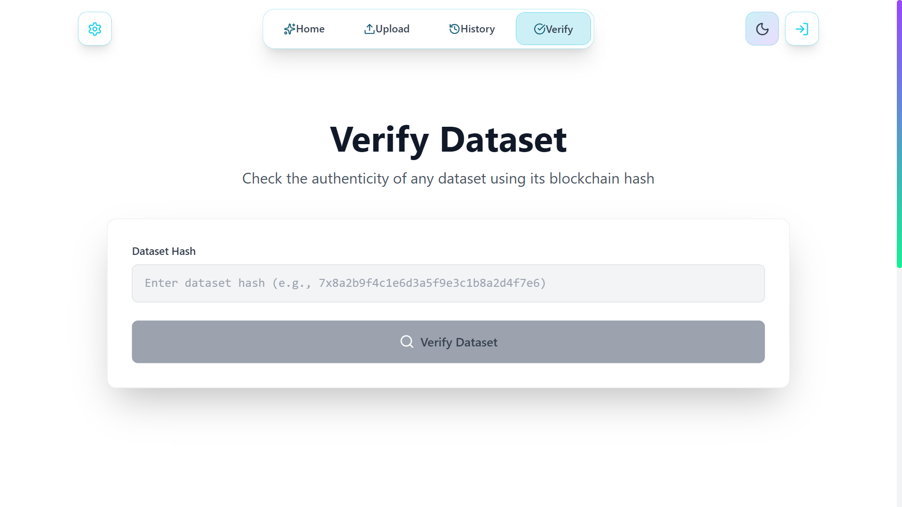
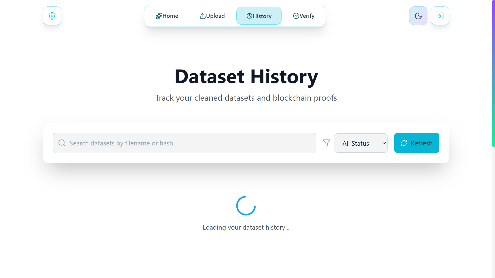
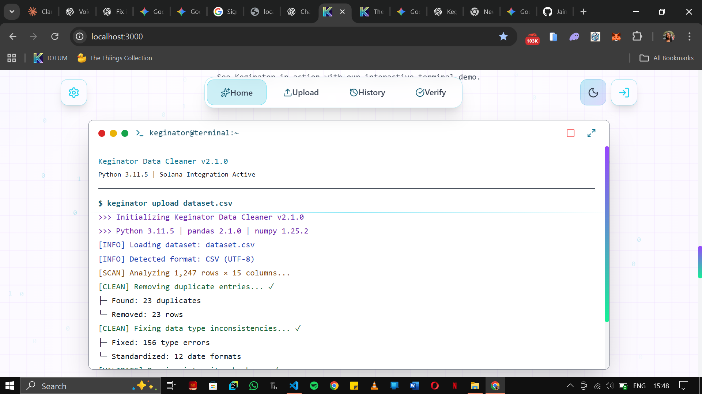

# ⚡ The Keginator: The Web3 AI Data Utility

<div align="center">

<!-- Main Logo -->


<!-- Badges & Tech Logos -->
<p>
<a href="https://github.com/JaimeCabary/The-keginator">

</a>
<a href="https://www.python.org/">


</a>
<a href="https://fastapi.tiangolo.com/">


</a>
<a href="https://reactjs.org/">


</a>
<a href="https://nextjs.org/">


</a>
<a href="https://solana.com/">


</a>
<a href="LICENSE">

</a>
</p>

<!-- Launch Button -->
<p>
<a href="https://keginator.vercel.app">

</a>
</p>

</div>


**The Keginator** is an AI-powered data preparation and provenance utility built to solve a simple, urgent problem: **data scientists and engineers should not lose time or hackathons because their data isn't ready.**

This application automates the massive human stress of preprocessing and cleaning datasets, then locks the integrity of that clean data onto the Solana blockchain, making it **provably trustworthy** at the lowest possible cost.

**Colosseum Hackathon Track: Infrastructure (Triton)**

---

## 💡 Our Origin Story: Born from Failure, Built for Speed

This entire project was born out of frustration. I recently lost a major Kaggle hackathon—a chance to fine-tune the Gemini 2.5 LLM—because I couldn't get my dataset ready on time.  
That failure showed me the painful truth: the stress of urgent data cleaning is a universal bottleneck.

The Keginator is my answer to that problem. It's built to help every machine learning person and data scientist bypass the stress of preprocessing and cleaning their dataset.

---

## 🌟 Problem & Solution Summary

| Problem | Solution: The Keginator |
| :--- | :--- |
| **Time-to-Train Stress:** Preprocessing and cleaning datasets for LLM fine-tuning consumes up to 80% of a data scientist's time. | **AI Data Cleaner:** An integrated AI applies data science principles to preprocess, chunk, fine-tune, and clean the dataset in split seconds. |
| **Data Integrity & Trust:** No verifiable method to prove a dataset was properly cleaned or remains untampered. | **Solana Provenance:** The SHA-256 hash of the final, *cleaned* dataset is permanently committed to a **Solana Program Derived Address (PDA)** for immutable proof. |
| **Cost Barrier:** Traditional tools are expensive, limiting access to quality data prep. | **Free Public Utility:** The core service is free, requiring only minimal Solana gas fees for the on-chain commitment transaction. |

---

## 🧠 The AI Engine: Cleaning with Context

The Keginator is not a simple script that removes bad data — it is a smart utility that does the complex work for you:

* **Contextual Reasoning:** The integrated AI reasons based on the context and structure of your data.  
* **Data Science Principles:** It applies preprocessing, normalization, scaling, and chunking methods automatically.  
* **Integrity Focused:** It ensures preprocessing without stripping context, preparing datasets for optimal LLM and ML use.  
* **Current Support:** Fully functional with **CSV** and **PDF** datasets.  

---

## ⛓️ The Solana Trust Layer: Why Web3 Infrastructure?

Once the AI produces a clean dataset, how do you *trust* it?  
We secure that integrity using Solana:

* **The Commitment:** We take the SHA-256 hash of the final, **cleaned** dataset.  
* **The Immutability:** That hash is logged immutably to a **Solana PDA** through our Anchor program.  
* **The Cost:** The core service is **free**—you only pay Solana’s minimal gas fees for the on-chain transaction.  
* **The Verification:** Anyone can verify via the `/verify/{hash}` endpoint and confirm authenticity on-chain.  

---

## 💻 Technical Stack

| Component | Technology | Role |
| :--- | :--- | :--- |
| **Blockchain** | **Solana (Anchor / Rust)** | Immutable hash logging & verification. |
| **Backend** | **FastAPI (Python)** | File uploads, AI cleaning logic, Solana API client. *(Hosted on Render — may take a few seconds to spin up)* |
| **Frontend** | **React / TypeScript** | Modern responsive UI for dataset upload, verification, and history. |
| **Data Processing** | **Pandas + ML Libraries** | Automated cleaning, scaling, and preprocessing. |

---

## 🛠️ Local Development Setup

To run **The Keginator** locally, install **Node.js**, **Python 3.10+**, and the **Solana Tool Suite**.

### 1. Backend Setup

```bash
cd backend
# Install Python dependencies
pip install -r requirements.txt

# Add environment variables in backend/.env:
# SOLANA_PRIVATE_KEY=<your 64-byte Solana key>
# KEGINATOR_PROGRAM_ID=<your deployed Anchor program ID>

# Start the backend (FastAPI)
uvicorn app.main:app --reload
```

### 2. Frontend Setup
```bash
# From the project root
cd frontend
npm install
npm start
# Opens at http://localhost:3000
```
### 3. Solana Program ID
```ini
    KEGINATOR_PROGRAM_ID = Fg6PaFpoGXkYsidMpWTK6W2BeZ7FEfcYkg476zPFsLnS
```

## 🖼️ Project Gallery (Screenshots)

<div align="center">

<table>
<tr>
<td align="center">
<br>
<b>Home 1</b><br>Main homepage interface
</td>
<td align="center">
<br>
<b>Home 2</b><br>Secondary homepage view / dashboard
</td>
</tr>
<tr>
<td align="center">
<br>
<b>Upload Page</b><br>File upload interface for CSV/PDF datasets
</td>
<td align="center">
<br>
<b>Verification Page</b><br>Verifying dataset authenticity via `/verify/{hash}`
</td>
</tr>
<tr>
<td align="center">
<br>
<b>History Page</b><br>Dashboard showing cleaned datasets and integrity history
</td>
<td align="center">
<br>
<b>Terminal</b><br>Local setup / backend running view
</td>
</tr>
</table>

</div>


## 🎥 Short Demo (Compressed)

A short video demo showing the full process — from dataset upload to blockchain verification.

**Demo file:** `assets/keginator-demo.mp4`  


[▶️ Watch demo (1 min)](https://youtu.be/your-demo-link)


## 🚀 Deployment Notes

- Backend is hosted on **Render**, so initial load may take a few seconds (cold start).  
- Frontend can be deployed on **Vercel** or **Netlify**.  
- Ensure your environment variables are configured in your Render dashboard and kept secret.  
- Your `KEGINATOR_PROGRAM_ID` must match the on-chain program when verifying transactions.

---

## 🧩 API Endpoints Overview

| Endpoint | Method | Description |
| :--- | :--- | :--- |
| `/upload` | POST | Upload a CSV or PDF dataset for cleaning. |
| `/verify/{hash}` | GET | Verify dataset hash integrity on Solana. |
| `/history` | GET | Retrieve all previously verified dataset hashes. |

---

## 🛡️ Security & Best Practices

- Never commit your `SOLANA_PRIVATE_KEY` or API credentials to GitHub.  
- Validate all uploads on the server (accept only `.csv` or `.pdf`).  
- Use **SSL** for all production endpoints.  
- Keep the Anchor program and RPC URLs versioned for consistency.

---

## 🛡️ License

This project is released under the **MIT License**.  
You’re free to use, modify, and build upon it — attribution appreciated.

---

## ❤️ Acknowledgments

Built with ❤️ by **Shalom Chidi-Azuwike**.  

Inspired by sleepless hackathons, dataset chaos, and the drive to make AI infrastructure better for everyone.

> “Half caffeine, half curiosity, 100% unresolved merge conflicts.”  
> — The Keginator Team
